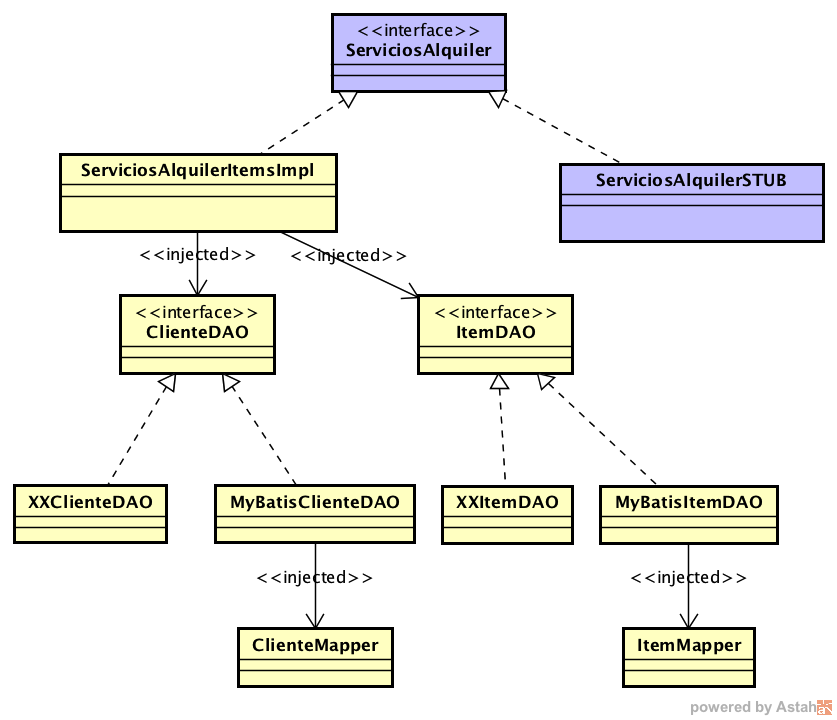

# LABORATORIO 8 - MYBATIS + GUICE + PRIMEFACES

[](https://app.codacy.com/gh/juanbaezl/LabCVDS_8?utm_source=github.com&utm_medium=referral&utm_content=juanbaezl/LabCVDS_8&utm_campaign=Badge_Grade_Settings)

## *ESCUELA COLOMBIANA DE INGENIERÍA*
## *INTRODUCCIÓN A PROYECTOS WEB*

# Integrantes
## *Juan Carlos Baez Lizarazo*
## *Nicolas Fernando Palacios Fajardo*



### PARTE I. INICIO EN CLASE
1. Actualice el proyecto del taller realizados en el ejercicio anterior. Agregue las clases y excepciones no descritas de ser necesario.

2. Cree la interface ItemDAO y utilicela como referencia para realizar los Objetos de Acceso a los Datos (DAO) para las demas entidades:

    ```package edu.eci.cvds.sampleprj.dao;

    import edu.eci.cvds.samples.entities.Item;

    public interface ItemDAO {

    public void save(Item it) throws PersistenceException;

    public Item load(int id) throws PersistenceException;

    }
    ```
3. Usando como referencia la implementación de ItemDAO: MyBATISItemDao, cree el DAO MyBATIS de las demas entidades:

    ```package edu.eci.cvds.sampleprj.dao.mybatis;

    import com.google.inject.Inject;
    import com.google.inject.Singleton;
    import edu.eci.cvds.sampleprj.dao.ItemDAO;
    import edu.eci.cvds.sampleprj.dao.PersistenceException;
    import edu.eci.cvds.sampleprj.dao.mybatis.mappers.ClienteMapper;
    import edu.eci.cvds.samples.entities.Item;
    import edu.eci.cvds.sampleprj.dao.mybatis.mappers.ItemMapper;
    import edu.eci.cvds.samples.entities.TipoItem;
    import java.sql.SQLException;

    public class MyBATISItemDAO implements ItemDAO{

    @Inject
    private ItemMapper itemMapper;    

    @Override
    public void save(Item it) throws PersistenceException{
    try{
        itemMapper.insertarItem(it);
    }
    catch(org.apache.ibatis.exceptions.PersistenceException e){
        throw new PersistenceException("Error al registrar el item "+it.toString(),e);
    }        

    }

    @Override
    public Item load(int id) throws PersistenceException {
    try{
        return itemMapper.consultarItem(id);
    }
    catch(org.apache.ibatis.exceptions.PersistenceException e){
        throw new PersistenceException("Error al consultar el item "+id,e);
    }


    }

    }
    ```
4. Cree la interface ServiciosAlquiler para los servicios de la capa lógica:

    ```package edu.eci.cvds.samples.services;

    import edu.eci.cvds.samples.entities.Cliente;
    import edu.eci.cvds.samples.entities.Item;
    import edu.eci.cvds.samples.entities.ItemRentado;
    import edu.eci.cvds.samples.entities.TipoItem;
    import java.sql.Date;
    import java.util.List;

    public interface ServiciosAlquiler {

    public abstract int valorMultaRetrasoxDia(int itemId);

    public abstract Cliente consultarCliente(long docu) throws ExcepcionServiciosAlquiler;

    /**
    * @obj Consultar los items que tenga en su poder un cliente
    * @param idcliente identificador del cliente
    * @return el litado de detalle de los items rentados por el cliente
    * identificado con 'idcliente'
    * @throws ExcepcionServiciosAlquiler si el cliente no esta registrado
    */
    public abstract List<ItemRentado> consultarItemsCliente(long idcliente) throws ExcepcionServiciosAlquiler;

    public abstract List<Cliente> consultarClientes() throws ExcepcionServiciosAlquiler;

    public abstract Item consultarItem(int id) throws ExcepcionServiciosAlquiler;

    /**
    * @obj consultar los items que estan disponibles para alquiler
    * @return el listado de items disponibles
    */
    public abstract List<Item> consultarItemsDisponibles();

    /**
    * @obj consultar el valor de la multa del alquiler, dado el id del item
    * alquilado hasta la fecha dada como parametro
    * @param iditem el codigo del item alquilado
    * @param fechaDevolucion la fecha de devolucion del item
    * @return la multa en funcion del numero de dias de retraso. Si el item se
    * entrega en la fecha exacta de entrega, o antes, la multa sera cero.
    * @throws ExcepcionServiciosAlquiler si el item no existe o no esta
    * actualmente alquilado
    */
    public abstract long consultarMultaAlquiler(int iditem, Date fechaDevolucion) throws ExcepcionServiciosAlquiler;

    public abstract TipoItem consultarTipoItem(int id) throws ExcepcionServiciosAlquiler;

    public abstract List<TipoItem> consultarTiposItem() throws ExcepcionServiciosAlquiler;

    /**
    * @obj rejistrar el alkiler de un item
    * @pre numdias >=1
    * @param date fecha de rejistro del alquiler
    * @param docu identificacion de a quien se le cargara el alquiler
    * @param item el identificador del item a alquilar
    * @param numdias el numero de dias que se le prestara el item
    * @pos el item ya no debe estar disponible, y debe estar asignado al
    * cliente
    * @throws ExcepcionXX si el identificador no corresponde con un item, o si
    * el mismo ya esta alquilado
    */
    public abstract void registrarAlquilerCliente(Date date, long docu, Item item, int numdias) throws ExcepcionServiciosAlquiler;

    public abstract void registrarCliente(Cliente p) throws ExcepcionServiciosAlquiler;

    /**
    * @obj consultar el costo del alquiler de un item
    * @pre numdias >=1
    * @param iditem el codigo del item
    * @param numdias el numero de dias que se va a alquilar
    * @return el costo total del alquiler, teniendo en cuesta el costo diario y
    * el numeo de dias del alquiler
    * @throws ExcepcionServiciosAlquiler si el identificador del item no existe
    */
    public abstract long consultarCostoAlquiler(int iditem, int numdias) throws ExcepcionServiciosAlquiler;

    public abstract void actualizarTarifaItem(int id, long tarifa) throws ExcepcionServiciosAlquiler;

    public abstract void registrarItem(Item i) throws ExcepcionServiciosAlquiler;

    public abstract void vetarCliente(long docu, boolean estado) throws ExcepcionServiciosAlquiler;

    }
    ```
5. Realice en la implementación de la capa lógica (ServiciosAlquilerImpl), inyecte los DAO que sean necesarios. Tome de ejemplo el ItemDAO.

    ```package edu.eci.cvds.samples.services.impl;

    import com.google.inject.Inject;
    import com.google.inject.Singleton;
    import edu.eci.cvds.sampleprj.dao.ClienteDAO;
    import edu.eci.cvds.sampleprj.dao.ItemDAO;
    import edu.eci.cvds.sampleprj.dao.PersistenceException;

    import edu.eci.cvds.samples.entities.Cliente;
    import edu.eci.cvds.samples.entities.Item;
    import edu.eci.cvds.samples.entities.ItemRentado;
    import edu.eci.cvds.samples.entities.TipoItem;
    import edu.eci.cvds.samples.services.ExcepcionServiciosAlquiler;
    import edu.eci.cvds.samples.services.ServiciosAlquiler;
    import java.sql.Date;
    import java.util.List;

    @Singleton
    public class ServiciosAlquilerImpl implements ServiciosAlquiler {

    @Inject
    private ItemDAO itemDAO;

    @Override
    public int valorMultaRetrasoxDia(int itemId) {
        throw new UnsupportedOperationException("Not supported yet.");
    }

    @Override
    public Cliente consultarCliente(long docu) throws ExcepcionServiciosAlquiler {
        throw new UnsupportedOperationException("Not supported yet.");
    }

    @Override
    public List<ItemRentado> consultarItemsCliente(long idcliente) throws ExcepcionServiciosAlquiler {
        throw new UnsupportedOperationException("Not supported yet.");
    }

    @Override
    public List<Cliente> consultarClientes() throws ExcepcionServiciosAlquiler {
        throw new UnsupportedOperationException("Not supported yet.");
    }

    @Override
    public Item consultarItem(int id) throws ExcepcionServiciosAlquiler {
        try {
            return itemDAO.load(id);
        } catch (PersistenceException ex) {
            throw new ExcepcionServiciosAlquiler("Error al consultar el item "+id,ex);
        }
    }

    @Override
    public List<Item> consultarItemsDisponibles() {
        throw new UnsupportedOperationException("Not supported yet.");
    }

    @Override
    public long consultarMultaAlquiler(int iditem, Date fechaDevolucion) throws ExcepcionServiciosAlquiler {
        throw new UnsupportedOperationException("Not supported yet.");
    }

    @Override
    public TipoItem consultarTipoItem(int id) throws ExcepcionServiciosAlquiler {
        throw new UnsupportedOperationException("Not supported yet.");
    }

    @Override
    public List<TipoItem> consultarTiposItem() throws ExcepcionServiciosAlquiler {
        throw new UnsupportedOperationException("Not supported yet.");
    }

    @Override
    public void registrarAlquilerCliente(Date date, long docu, Item item, int numdias) throws ExcepcionServiciosAlquiler {
        throw new UnsupportedOperationException("Not supported yet.");
    }

    @Override
    public void registrarCliente(Cliente c) throws ExcepcionServiciosAlquiler {
        throw new UnsupportedOperationException("Not supported yet.");
    }

    @Override
    public long consultarCostoAlquiler(int iditem, int numdias) throws ExcepcionServiciosAlquiler {
        throw new UnsupportedOperationException("Not supported yet.");
    }

    @Override
    public void actualizarTarifaItem(int id, long tarifa) throws ExcepcionServiciosAlquiler {
        throw new UnsupportedOperationException("Not supported yet.");
    }
    @Override
    public void registrarItem(Item i) throws ExcepcionServiciosAlquiler {
        throw new UnsupportedOperationException("Not supported yet."); //To change body of generated methods, choose Tools | Templates.
    }

    @Override
    public void vetarCliente(long docu, boolean estado) throws ExcepcionServiciosAlquiler {
        throw new UnsupportedOperationException("Not supported yet."); //To change body of generated methods, choose Tools | Templates.
    }
    }
    ```
6. Realice la implementación de un servicio Stub (ServiciosAlquilerItemsStub) para que se pueda probar la lógica facilmente sin la capa de persistencia:

    ```package edu.eci.cvds.samples.services.impl;

    import edu.eci.cvds.samples.entities.Cliente;
    import edu.eci.cvds.samples.entities.Item;
    import edu.eci.cvds.samples.entities.ItemRentado;
    import edu.eci.cvds.samples.entities.TipoItem;
    import edu.eci.cvds.samples.services.ExcepcionServiciosAlquiler;
    import edu.eci.cvds.samples.services.ServiciosAlquiler;

    import java.io.Serializable;
    import java.sql.Date;
    import java.time.LocalDate;
    import java.time.temporal.ChronoUnit;
    import java.util.ArrayList;
    import java.util.HashMap;
    import java.util.LinkedList;
    import java.util.List;
    import java.util.Map;

    public class ServiciosAlquilerItemsStub implements ServiciosAlquiler {

    private static final int MULTA_DIARIA=5000;
    private final static long MILLISECONDS_IN_DAY = 24 * 60 * 60 * 1000;

    private final Map<Long,Cliente> clientes;
    private final Map<Integer,Item> itemsDisponibles;
    private final Map<Integer,ItemRentado> itemsrentados;
    private final Map<Integer,TipoItem> tipositems;

    private final Map<Integer,Long> mapaPrestamosPorIdCliente;

    public ServiciosAlquilerItemsStub() {
        clientes = new HashMap<>();
        itemsDisponibles = new HashMap<>();
        itemsrentados = new HashMap<>();
        tipositems = new HashMap<>();
        mapaPrestamosPorIdCliente=new HashMap<>();
        //poblar();
    }

    @Override
    public int valorMultaRetrasoxDia(int itemId) {
        return MULTA_DIARIA;
    }

    @Override
    public Cliente consultarCliente(long docu) throws ExcepcionServiciosAlquiler {
        Cliente c=null;
        if(clientes.containsKey(docu)){
            c=clientes.get(docu);
        }
        return c;
    }

    @Override
    public List<Cliente> consultarClientes() throws ExcepcionServiciosAlquiler {
        return  new LinkedList<>(clientes.values());
    }

    @Override
    public void registrarCliente(Cliente p) throws ExcepcionServiciosAlquiler {
        if (!clientes.containsKey(p.getDocumento())) {
            clientes.put(p.getDocumento(), p);
        } else {
            throw new ExcepcionServiciosAlquiler("El cliente con documento "+p+" ya esta registrado.");
        }
    }

    @Override
    public void vetarCliente(long docu, boolean estado) throws ExcepcionServiciosAlquiler {
        if(clientes.containsKey(docu)){
            Cliente c=clientes.get(docu);
            c.setVetado(estado);            
        }
        else{throw new ExcepcionServiciosAlquiler("Cliente no registrado:"+docu);}
    }

    @Override
    public Item consultarItem(int id) throws ExcepcionServiciosAlquiler {
        Item i = null;
        if(itemsDisponibles.containsKey(id)){
            i=itemsDisponibles.get(id);
        }
        else{
            throw new ExcepcionServiciosAlquiler("Item no registrado:"+id);
        }                
        return i;
    }

    @Override
    public List<Item> consultarItemsDisponibles()  {
        return  new LinkedList<>(itemsDisponibles.values());
    }

    @Override
    public void registrarItem(Item i) throws ExcepcionServiciosAlquiler {
        if (!itemsDisponibles.containsKey(i.getId())) {
            itemsDisponibles.put(i.getId(), i);
        } else {
            throw new ExcepcionServiciosAlquiler("El item " + i.getId() + " ya esta registrado.");
        }
    }

    @Override
    public void actualizarTarifaItem(int id, long tarifa) throws ExcepcionServiciosAlquiler {
        if (!itemsDisponibles.containsKey(id)) {
            Item c = itemsDisponibles.get(id);
            c.setTarifaxDia(tarifa);
            itemsDisponibles.put(id, c);
        } else {
            throw new ExcepcionServiciosAlquiler("El item " + id + " no esta registrado.");
        }
    }

    @Override
    public TipoItem consultarTipoItem(int id) throws ExcepcionServiciosAlquiler {
        TipoItem i = null;
        if(!tipositems.containsKey(id)){
            i=tipositems.get(id);
        }
        return i;

    }

    @Override
    public List<TipoItem> consultarTiposItem() throws ExcepcionServiciosAlquiler {
        return  new LinkedList<>(tipositems.values());
    }

    @Override
    public void registrarAlquilerCliente(Date date,long docu, Item item, int numdias) throws ExcepcionServiciosAlquiler {

        LocalDate ld=date.toLocalDate();
        LocalDate ld2=ld.plusDays(numdias);

        ItemRentado ir=new ItemRentado(0,item,date,java.sql.Date.valueOf(ld2));

        if (clientes.containsKey(docu)) {
            Cliente c = clientes.get(docu);
            c.getRentados().add(ir);
            itemsDisponibles.remove(ir.getItem().getId());
            itemsrentados.put(item.getId(), ir);
            mapaPrestamosPorIdCliente.put(item.getId(),docu);
        } else {
            throw new ExcepcionServiciosAlquiler("No existe el cliente con el documento " + docu);
        }
    }

    @Override
    public List<ItemRentado> consultarItemsCliente(long idcliente) throws ExcepcionServiciosAlquiler{        
        if (clientes.containsKey(idcliente)) {
            Cliente c = clientes.get(idcliente);
            return c.getRentados();            
        } else {
            throw new ExcepcionServiciosAlquiler("Cliente no registrado:" + idcliente);
        }

    }

    private Cliente consultarClienteConItem(int iditem) throws ExcepcionServiciosAlquiler{
        if (mapaPrestamosPorIdCliente.containsKey(iditem)){  
            long idcli=mapaPrestamosPorIdCliente.get(iditem);
            if (clientes.containsKey(mapaPrestamosPorIdCliente.get(iditem))){
                return clientes.get(idcli);
            }
            else{
                throw new ExcepcionServiciosAlquiler("El cliente "+idcli+" asociado al "
                        + "alquiler del item "+iditem+" no esta registrado.");
            }                        
        }
        else{
            throw new ExcepcionServiciosAlquiler("El item "+iditem+ " no esta alquilado.");
        }
    }

    @Override
    public long consultarMultaAlquiler(int iditem,Date fechaDevolucion) throws ExcepcionServiciosAlquiler{
        if (!itemsrentados.containsKey(iditem)){
            throw new ExcepcionServiciosAlquiler("El item "+iditem+"no esta en alquiler");
        }
        else{
            ItemRentado ir=itemsrentados.get(iditem);

            LocalDate fechaMinimaEntrega=ir.getFechafinrenta().toLocalDate();
            LocalDate fechaEntrega=fechaDevolucion.toLocalDate();
            long diasRetraso = ChronoUnit.DAYS.between(fechaMinimaEntrega, fechaEntrega);
            return diasRetraso*MULTA_DIARIA;
        }
    }

    @Override
    public long consultarCostoAlquiler(int iditem, int numdias) throws ExcepcionServiciosAlquiler {
        if (!itemsDisponibles.containsKey(iditem)) {
            throw new ExcepcionServiciosAlquiler("El item " + iditem + " no esta disponible.");
        } else {
            return itemsDisponibles.get(iditem).getTarifaxDia()*numdias;
        }

    }

    private void poblar() {

        TipoItem ti1=new TipoItem(1,"Video");
        TipoItem ti2=new TipoItem(2,"Juego");
        TipoItem ti3=new TipoItem(3,"Musica");
        tipositems.put(1,ti1);
        tipositems.put(2,ti2);
        tipositems.put(3,ti3);

        Item i1=new Item(ti1, 1, "Los 4 Fantasticos", "Los 4 Fantásticos  es una película de superhéroes  basada en la serie de cómic homónima de Marvel.", java.sql.Date.valueOf("2005-06-08"), 2000, "DVD", "Ciencia Ficcion");
        Item i2=new Item(ti2, 2, "Halo 3", "Halo 3 es un videojuego de disparos en primera persona desarrollado por Bungie Studios.", java.sql.Date.valueOf("2007-09-08"), 3000, "DVD", "Shooter");
        Item i3=new Item(ti3, 3, "Thriller", "Thriller es una canción interpretada por el cantante estadounidense Michael Jackson, compuesta por Rod Temperton y producida por Quincy Jones.", java.sql.Date.valueOf("1984-01-11"), 2000, "DVD", "Pop");
        Item i4=new Item(ti1, 4, "Los 4 Fantasticos", "Los 4 Fantásticos  es una película de superhéroes  basada en la serie de cómic homónima de Marvel.", java.sql.Date.valueOf("2005-06-08"), 2000, "DVD", "Ciencia Ficcion");
        Item i5=new Item(ti2, 5, "Halo 3", "Halo 3 es un videojuego de disparos en primera persona desarrollado por Bungie Studios.", java.sql.Date.valueOf("2007-09-08"), 3000, "DVD", "Shooter");
        Item i6=new Item(ti3, 6, "Thriller", "Thriller es una canción interpretada por el cantante estadounidense Michael Jackson, compuesta por Rod Temperton y producida por Quincy Jones.", java.sql.Date.valueOf("1984-01-11"), 2000, "DVD", "Pop");
        //items.put(1, i1);
        //items.put(2, i2);
        //items.put(3, i3);
        itemsDisponibles.put(4, i4);
        itemsDisponibles.put(5, i5);
        itemsDisponibles.put(6, i6);

        ItemRentado ir1=new ItemRentado(0,i1, java.sql.Date.valueOf("2017-01-01"), java.sql.Date.valueOf("2017-03-12"));
        ItemRentado ir2=new ItemRentado(0,i2, java.sql.Date.valueOf("2017-01-04"), java.sql.Date.valueOf("2017-04-7"));
        ItemRentado ir3=new ItemRentado(0,i1, java.sql.Date.valueOf("2017-01-07"), java.sql.Date.valueOf("2017-07-12"));

        ArrayList<ItemRentado> list1 = new ArrayList<>();
        list1.add(ir1);
        ArrayList<ItemRentado> list2 = new ArrayList<>();
        list2.add(ir2);
        ArrayList<ItemRentado> list3 = new ArrayList<>();
        list3.add(ir3);

        Cliente c1=new Cliente("Oscar Alba", 1026585664, "6788952", "KRA 109#34-C30", "oscar@hotmail.com", false,list1);
        Cliente c2=new Cliente("Carlos Ramirez", 1026585663, "6584562", "KRA 59#27-a22", "carlos@hotmail.com", false,list2);
        Cliente c3=new Cliente("Ricardo Pinto", 1026585669, "4457863", "KRA 103#94-a77", "ricardo@hotmail.com", false,list3);
        clientes.put(c1.getDocumento(), c1);
        clientes.put(c2.getDocumento(), c2);
        clientes.put(c3.getDocumento(), c3);

    }
    }
    ```
7. Cree la clase ServiciosAlquilerFactory para que además de hacer ‘bind’ de la interfaz ServiciosAlquier con la implementación ServiciosAlquilerImpl, haga ‘bind’ de las entidades, por ejemplo, para ItemDAO se asocia con MyBATISItemDAO.

    ```package edu.eci.cvds.samples.services;

    import com.google.inject.Injector;
    import edu.eci.cvds.sampleprj.dao.ClienteDAO;
    import edu.eci.cvds.sampleprj.dao.ItemDAO;
    import edu.eci.cvds.sampleprj.dao.TipoItemDAO;
    import edu.eci.cvds.sampleprj.dao.mybatis.MyBATISClienteDAO;
    import edu.eci.cvds.sampleprj.dao.mybatis.MyBATISItemDAO;
    import edu.eci.cvds.sampleprj.dao.mybatis.MyBATISTipoItemDAO;
    import edu.eci.cvds.samples.services.impl.ServiciosAlquilerItemsImpl;
    import org.apache.ibatis.transaction.TransactionFactory;
    import org.apache.ibatis.transaction.jdbc.JdbcTransactionFactory;
    import org.mybatis.guice.XMLMyBatisModule;

    import java.util.Optional;

    import static com.google.inject.Guice.createInjector;

    public class ServiciosAlquilerFactory {

    private static ServiciosAlquilerFactory instance = new ServiciosAlquilerFactory();

    private static Optional<Injector> optInjector;

    private Injector myBatisInjector(String env, String pathResource) {
        return createInjector(new XMLMyBatisModule() {
            @Override
            protected void initialize() {
                setEnvironmentId(env);
                setClassPathResource(pathResource);
                bind(ItemDAO.class).to(MyBATISItemDAO.class);
                bind(ServiciosAlquiler.class).to(ServiciosAlquilerItemsImpl.class);
            }
        });
    }

    private ServiciosAlquilerFactory(){
        optInjector = Optional.empty();
    }

    public ServiciosAlquiler getServiciosAlquiler(){
        if (!optInjector.isPresent()) {
            optInjector = Optional.of(myBatisInjector("development","mybatis-config.xml"));
        }

        return optInjector.get().getInstance(ServiciosAlquiler.class);
    }


    public ServiciosAlquiler getServiciosAlquilerTesting(){
        if (!optInjector.isPresent()) {
            optInjector = Optional.of(myBatisInjector("test","mybatis-config-h2.xml"));
        }

        return optInjector.get().getInstance(ServiciosAlquiler.class);
    }


    public static ServiciosAlquilerFactory getInstance(){
        return instance;
    }

    }
    ```
8. Pruebe el programa ‘Main’ suministrado, y con este rectifique que a través de la capa lógica se pueda consultar un cliente.

9. Implemente los métodos que sean necesarios en las interfaces de las entidades (DAO) y en sus implementaciones haciendo uso del DAO inyectado. Haga un programa para comprobar que la consulta de un cliente se haga correctamente, a través de la capa lógica.

### PARTE II - PRUEBAS
1. Implemente las operaciones de la lógica que hagan falta para satisfacer los requerimientos para la capa de presentación, teniendo en cuenta, que puede requerir agregar más operaciones a los DAOs -y por ende- más mappers de MyBATIS.

2. Tenga en cuenta: las operaciones que impliquen registrar o actualizar registros, demarcar la transaccionalidad con la anotación @Transactional.

3. Cree el archivo de configuracion de la base de datos de pruebas que es de tipo h2, en el directorio src/main/resources:

    ```<?xml version="1.0" encoding="UTF-8" ?>
    <!DOCTYPE configuration
    PUBLIC "-//mybatis.org//DTD Config 3.0//EN"
    "http://mybatis.org/dtd/mybatis-3-config.dtd">
    <configuration>

    <typeAliases>
        <typeAlias type='edu.eci.cvds.samples.entities.Cliente' alias='Cliente'/>
        <typeAlias type='edu.eci.cvds.samples.entities.Item' alias='Item'/>
        <typeAlias type='edu.eci.cvds.samples.entities.ItemRentado' alias='ItemRentado'/>
        <typeAlias type='edu.eci.cvds.samples.entities.TipoItem' alias='TipoItem'/>
    </typeAliases>

    <environments default="test">
        <environment id="test">
            <transactionManager type="JDBC" />
            <dataSource type="POOLED">
                <property name="driver" value="org.h2.Driver" />
                <property name="url" value="jdbc:h2:file:./target/db/testdb;MODE=MYSQL" />
                <property name="username" value="sa" />
                <property name="password" value="" />
            </dataSource>
        </environment>
    </environments>

    <mappers>
        <mapper resource="mappers/ClienteMapper.xml"></mapper>
        <mapper resource="mappers/ItemMapper.xml"></mapper>
        <mapper resource="mappers/ItemRentadoMapper.xml"></mapper>
        <mapper resource="mappers/TipoItemMapper.xml"></mapper>
    </mappers> 

    </configuration>
    ```
4. Cree un archivo de pruebas

    ```package edu.eci.cvds.test;

    import java.util.ArrayList;
    import java.util.List;

    import com.google.inject.Inject;
    import edu.eci.cvds.sampleprj.dao.PersistenceException;
    import edu.eci.cvds.samples.entities.Cliente;
    import edu.eci.cvds.samples.entities.ItemRentado;
    import edu.eci.cvds.samples.services.ExcepcionServiciosAlquiler;
    import edu.eci.cvds.samples.services.ServiciosAlquiler;
    import edu.eci.cvds.samples.services.ServiciosAlquilerFactory;
    import org.apache.ibatis.session.SqlSession;
    import org.junit.Before;
    import org.junit.Test;
    import org.junit.Assert;

    public class ServiciosAlquilerTest {

        @Inject
        private SqlSession sqlSession;

        ServiciosAlquiler serviciosAlquiler;

        public ServiciosAlquilerTest() {
            serviciosAlquiler = ServiciosAlquilerFactory.getInstance().getServiciosAlquilerTesting();
        }

        @Before
        public void setUp() {
        }

        @Test
        public void emptyDB() {
            for(int i = 0; i < 100; i += 10) {
                boolean r = false;
                try {
                    Cliente cliente = serviciosAlquiler.consultarCliente(documento);
                } catch(ExcepcionServiciosAlquiler e) {
                    r = true;
                } catch(IndexOutOfBoundsException e) {
                    r = true;
                }
                // Validate no Client was found;
                Assert.assertTrue(r);
            };
        }
    }
    ```
5. Cree diferentes pruebas utilizando las clases de equivalencia necesarias para las diferentes operaciones definidas en los servicios.

### PARTE III - CAPA PRESENTACIÓN
1. Realice los cambios necesarios en el archivo pom.xml de tal forma que el proyecto se construya de manera correcta como una aplicación WEB, incluyendo las dependencias (jstl, jsf-api, jsf-impl, primefaces, etc) y los plugins (maven war, tomcat7 maven, etc.).

2. Agregue el archivo web.xml requerido con la configuración necesaria. Al final del archivo agregue el siguiente listener:

    ```<listener>
        <listener-class>edu.eci.cvds.guice.GuiceContextListener</listener-class>
    </listener>
    ```
3. Cree el listener con el paquete y nombre indicados de forma que se asocie la configuración de Guice y MyBatis a la inicialización del contexto de la aplicación en el servidor tomcat7 embebido, con el siguiente contenido inicial, resolviendo el ‘TODO’ (asociando la interfaz del servicio a la implementación Stub):

    ```package edu.eci.cvds.guice;

    import javax.servlet.ServletContext;
    import javax.servlet.ServletContextEvent;
    import javax.servlet.ServletContextListener;
    import org.mybatis.guice.XMLMyBatisModule;
    import org.mybatis.guice.datasource.helper.JdbcHelper;
    import com.google.inject.Guice;
    import com.google.inject.Injector;

    public class GuiceContextListener implements ServletContextListener {

        public void contextDestroyed(ServletContextEvent servletContextEvent) {
            ServletContext servletContext = servletContextEvent.getServletContext();
            servletContext.removeAttribute(Injector.class.getName());
        }

        public void contextInitialized(ServletContextEvent servletContextEvent) {
            Injector injector = Guice.createInjector(new XMLMyBatisModule() {
                @Override
                protected void initialize() {
                    install(JdbcHelper.MySQL);
                    setEnvironmentId("development");
                    setClassPathResource("mybatis-config.xml");

                    // TODO Add service class associated to Stub implementation
                    bind(AAA.class).to(YYY.class);
                    bind(BBB.class).to(ZZZ.class);
                }
            });

            servletContextEvent.getServletContext().setAttribute(Injector.class.getName(), injector);
        }
    }
    ```
4. Cree el bean BasePageBean en el paquete “edu.eci.cvds.view” con el siguiente contenido para que se puedan inyectar los componentes necesarios en todas las clases “hijas” que serán los beans de la capa de presentación:

    ```package edu.eci.cvds.view;

    import java.io.Serializable;
    import javax.annotation.PostConstruct;
    import javax.faces.context.FacesContext;
    import javax.servlet.ServletContext;
    import com.google.inject.Injector;

    public abstract class BasePageBean implements Serializable {

        private Injector injector;

        public Injector getInjector() {
            if (injector == null) {
                ServletContext servletContext = (ServletContext) FacesContext.getCurrentInstance().getExternalContext()
                        .getContext();
                injector = (Injector) servletContext.getAttribute(Injector.class.getName());
            }
            return injector;
        }

        public void setInjector(Injector injector) {
            this.injector = injector;
        }

        @PostConstruct
        public void init() {
            getInjector().injectMembers(this);
        }
    }
    ```
5. Implementar la aplicación Web que permita agregar nuevos clientes a la videotienda, y registrar alquileres para los mismos. Ambas funcionalidades estarán en dos vistas diferentes (registrocliente.xhtml, registroalquiler.xhtml), de acuerdo con las siguientes especificaciones (tenga en cuenta que, por ahora, la aplicación no maneja ningún esquema de autenticación):

    1. La vista de ‘registro de clientes’ debe (1) mostrar el listado paginado de los clientes registrados hasta el momento (con la opción de selecciar de uno de éstos), y (2) debe mostrar los campos para poder registrar un nuevo cliente (con su respectivo botón de registro). Cuando se registre un nuevo cliente, se deberá mostrar automáticamente el nuevo cliente en la parte superior.
    2. Cuando se seleccione uno de los usuarios ya creados, se debe redirigir al usuario a la vista de ‘registro de alquileres’. En esta vista, dado el cliente seleccionado, se debe (1) mostrar los items que no ha regresado, junto con el valor de la multa total asociada a los mismos a la fecha (fecha del sistema), y (2), debe permtir registrar un nuevo alquiler ingresando el código del item (asumiendo que éste se ingresará con un lector de código de barras), el número de días del alquiler, y mostrando el costo del alquiler antes de su confirmación. En el momento que se confirme, se debe volver a la página anterior (registro de clientes).
    3. Ambas vistas se basarán en el ManagedBean de sesión ‘AlquilerItemsBean’ que debe extender ‘BasePageBean’, el cual -a su vez- hace uso de la interfaz ‘ServiciosAlquiler’ (no agregar directamente una implementación concreta, esto se realizará en la configuración de Guice).
    4. El desarrollo de ambas vistas debe quedar distribuido entre los dos desarrolladores de la siguiente manera:

        - Desarrollador 1: Vista registro de cliente.
        - Desarrollador 2: Vista registro de alquiler.
        - Desarrollador 1 y 2: ManagedBean ‘AlquilerItemsBean’.
        - Cada integrante debe realizar su propio commit pues después se verificarán los cambios de cada uno.
Nota. Para ver cómo navegar entre vistas con JSF revise este enlace.

6. Construya y despliegue la aplicación con el comando mvn tomcat7:run y realice pruebas de la presentación, que debe estar funcionando correctamente, con la implementación ‘Stub’ del servicio de alquiler.

7. Modifique la configuración de Guice para asociar a la interfaz, el servicio concreto de alquileres, de forma que todos los cambios que se realicen en la presentación, se actualicen en base de datos de manera correcta.

8. Realice los ajustes necesarios para que la aplicación funcione de manera correcta y se asegure que todos los métodos están realizando las operaciones sobre la base de datos.

### PARTE IV - ENTREGA CONTINUA
1. Realice toda la configuración necesaria de CircleCI y Heroku para que la aplicación se construya y despliegue de manera automática cada que se realice un commit al repositorio.

2. Realice también todas las configuraciones necesarias de Codacy y los ajustes necesarios para obtener una calificación satisfactoria.

3. Verifique que la aplicación se despliegue correctamente en Heroku y sea completamente funcional, tal como se encontraba en local.

4. Agregue en el Readme los enlaces necesarios a Heroku, Codacy, etc. para que se pueda verificar el correcto funcionamiento de toda la aplicación.

### ENTREGA:
1. En los ‘logs’ de GitHub debe quedar evidencia de los ‘commit’ realizados por cada autor, y en computadores diferentes (esto es verificable). Para esto, no olvide configurar su usuario antes de hacer los commits:
    ```
    $ git config --global user.name "John Doe"
    $ git config --global user.email johndoe@example.com
    ```
2. Subir en el espacio de moodle la URL del repositorio en GitHUB.